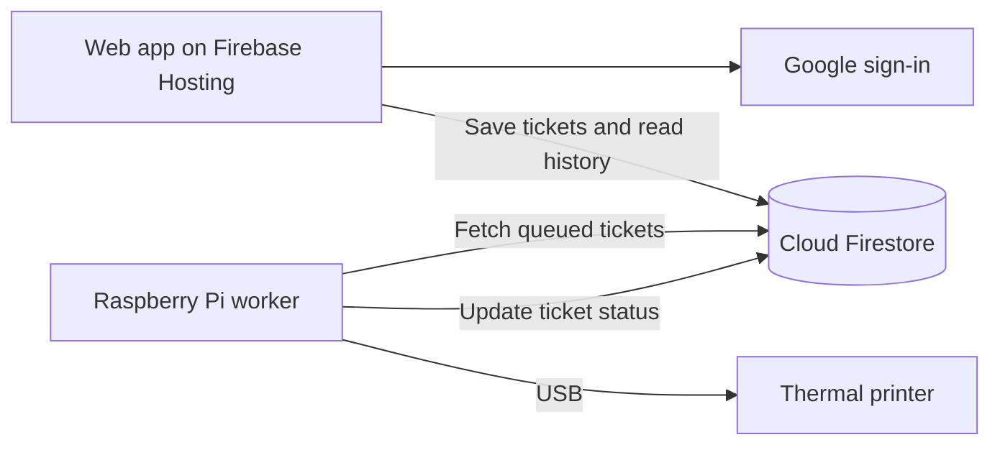

# Remote Post-it printer

Web app that prints tickets out with a USB thermal printer. Because I can't write TODO Post-it notes if I'm not at my desk.

## How it works

1. Put in ticket details at [todo.railton.dev](todo.railton.dev)
2. Data is stored in Firestore
3. A Raspberry Pi worker checks for queued tickets every five seconds while idle, processes them oldest first, formats them and sends them to the printer over USB.



There's no confirmation that tickets were actually physically printed. 

## Development

Preview the web app with Firebase Hosting:

```bash
npx --package=node@24 --package=firebase-tools -- firebase emulators:start --only hosting
```

Open the local URL shown by the CLI. Hosting supplies the Firebase configuration, so a plain static server is insufficient. This command emulates Hosting only: sign-in and ticket storage use the real Firebase project.

Deploy the website, database rules and queue indexes:

```bash
npx --package=node@24 --package=firebase-tools -- firebase deploy --only hosting,firestore
```

Can also deploy via GitHub actions at https://github.com/annarailton/remote-post-it/actions 

## Printer setup

See [the Pi setup guide](pi/README.md) for worker installation, credentials and the ticket printing service.
